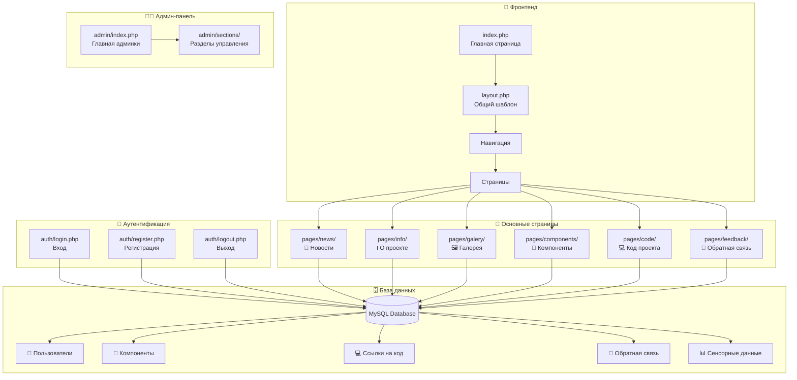
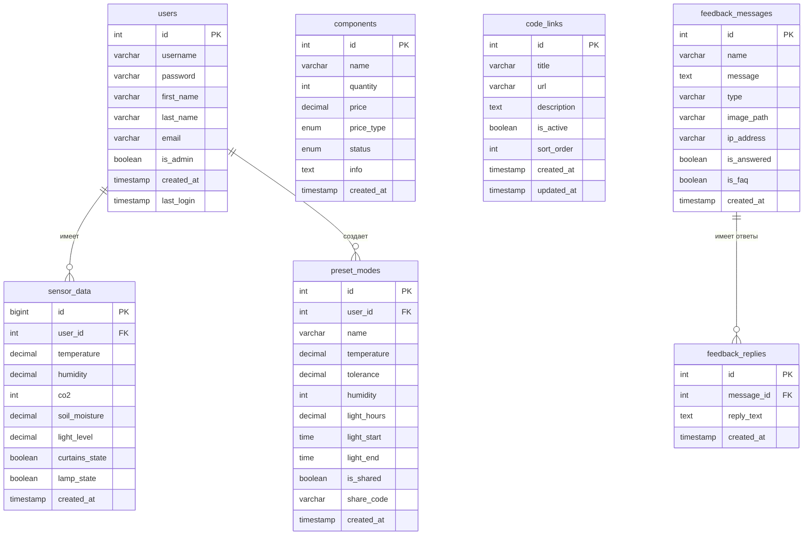
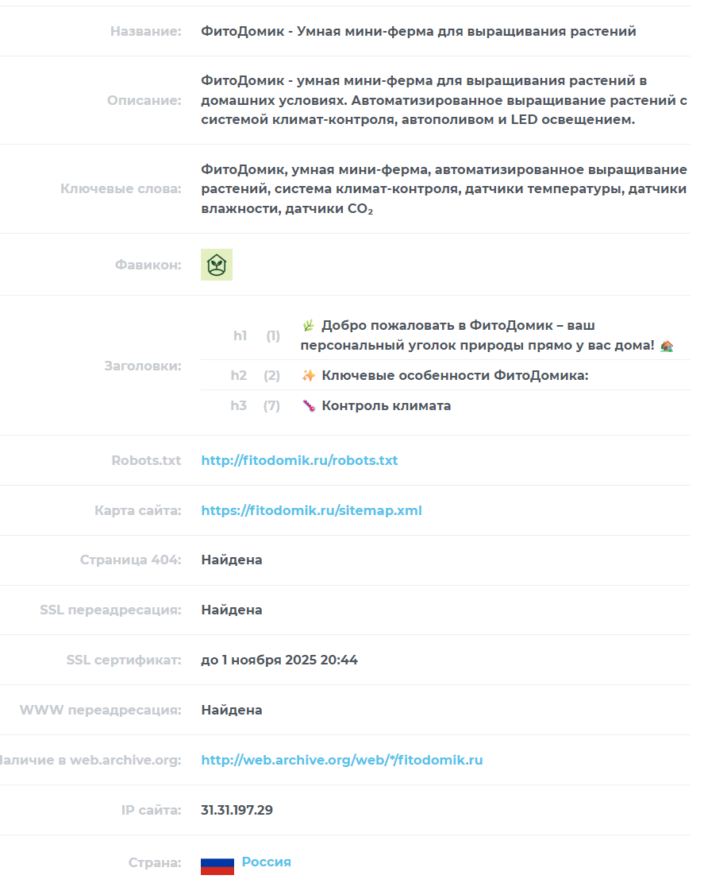

[](preview.mp4)

Комплексная система управления умной фермой, состоящая из веб-приложения для мониторинга и управления, а также Python приложения с графическим интерфейсом, развернутого на Raspberry Pi и подключенного к Arduino с датчиками для автоматизированного выращивания растений.

# 🌱 ФитоДомик - Умная мини-ферма

> 🚀 Современное веб-приложение для управления умной мини-фермой с полным набором инструментов мониторинга и контроля

## 📋 Содержание

- [🏗️ Структура проекта](#️-структура-проекта)
- [📁 Описание файлов](#-описание-файлов)
- [🏛️ Архитектура проекта](#️-архитектура-проекта)
- [📚 Библиотеки и технологии](#-библиотеки-и-технологии)
- [🚀 Запуск и развертывание](#-запуск-и-развертывание)
- [⚡ Архитектурные особенности](#-архитектурные-особенности)
- [📊 Статистика сайта](#-статистика-сайта)

## 🏗️ Структура проекта

```
fitodomik.ru/
├── 🏠 index.php                        # Главная страница проекта
├── 🎨 layout.php                       # Общий шаблон для всех страниц
├── ⚙️ config.php                       # Конфигурация базы данных и общие функции
├── 🗄️ Info.sql                        # Схема базы данных
├── 📧 feedback.php                     # Обработка обратной связи
├── 🔍 opensearch.xml                   # Настройки поиска для браузеров
├── 🤖 robots.txt                       # Инструкции для поисковых ботов
├── 🗺️ sitemap.xml                      # Карта сайта
├── 404.php                            # Страница ошибки 404
└── .htaccess                          # Конфигурация Apache
│
├── 👨‍💼 admin/                           # Административная панель
│   ├── index.php                      # Главная страница админки
│   ├── config.php                     # Конфигурация админки
│   ├── .htaccess                      # Защита админ-панели
│   └── sections/                      # Разделы админки
│       ├── 💻 code.php                # Управление ссылками на код
│       ├── 🔧 components.php          # Управление компонентами
│       ├── 📊 dashboard.php           # Панель управления
│       ├── 💬 feedback.php            # Управление обратной связью
│       ├── 🖼️ gallery.php             # Управление галереей
│       ├── ℹ️ info.php                # Управление информацией
│       ├── 📰 news.php                # Управление новостями
│       └── 👥 users.php               # Управление пользователями
│
├── 🎨 assets/                         # Статические ресурсы
│   ├── css/                           # Стили
│   │   ├── bootstrap-icons.css        # Иконки Bootstrap
│   │   ├── qr-code.css               # Стили для QR-кодов
│   │   └── style.css                 # Основные стили
│   ├── fonts/                         # Шрифты
│   │   └── bootstrap-icons/           # Шрифты иконок
│   └── js/                            # JavaScript
│       └── theme.js                   # Переключение тем
│
├── 🔐 auth/                           # Система аутентификации
│   ├── login.php                      # Страница входа
│   ├── logout.php                     # Выход из системы
│   └── register.php                   # Регистрация пользователей
│
├── 🛠️ includes/                       # Вспомогательные файлы
│   ├── debug.php                      # Система логирования и отладки
│   ├── qr_code.php                   # Генерация QR-кодов
│   ├── seo_tags.php                  # SEO метатеги
│   └── session.php                   # Управление сессиями
│
├── 📄 pages/                          # Основные страницы сайта
│   ├── about.php                      # О проекте
│   ├── 💻 code/                       # Раздел с кодом
│   │   └── index.php                  # Ссылки на репозитории
│   ├── 🔧 components/                 # Компоненты проекта
│   │   ├── index.php                  # Список компонентов
│   │   └── export.php                 # Экспорт компонентов
│   ├── 💬 feedback/                   # Обратная связь
│   │   ├── index.php                  # Форма обратной связи
│   │   ├── feedback.php               # Обработка формы
│   │   ├── submit_feedback.php        # Отправка обратной связи
│   │   └── .htaccess                  # Защита директории
│   ├── 🖼️ galery/                     # Галерея
│   │   └── index.php                  # Просмотр галереи
│   ├── ℹ️ info/                       # Информация о проекте
│   │   └── index.php                  # Хронология проекта
│   └── 📰 news/                       # Новости
│       └── index.php                  # Список новостей
│
├── 🎯 icon/                           # Иконки сайта
│   ├── favicon.ico                   # Основная иконка
│   ├── android-chrome-*.png          # Иконки для Android
│   ├── apple-touch-icon.png          # Иконка для iOS
│   └── site.webmanifest              # Манифест веб-приложения
│
└── 📤 uploads/                        # Загруженные файлы
    └── gallery/                       # Изображения галереи
```

## 📁 Описание файлов

### 🏠 Корневые файлы

#### `index.php` - Главная страница
- **🎯 Назначение**: Презентация проекта ФитоДомик
- **⚡ Ключевые функции**: 
  - Отображение информации о мини-ферме
  - Интеграция с Яндекс.Метрикой
  - Генерация QR-кода для Telegram
- **🔗 Связи**: Использует `layout.php`, `includes/session.php`, `includes/qr_code.php`

#### `layout.php` - Универсальный шаблон
- **🎯 Назначение**: Общий шаблон для всех страниц сайта
- **⚡ Ключевые функции**:
  - HTML-структура с Bootstrap
  - Навигационное меню
  - Переключение темы (🌞/🌙)
  - SEO-оптимизация
  - Интеграция Яндекс.Метрики

#### `config.php` - Центр конфигурации
- **🎯 Назначение**: Центральная конфигурация проекта
- **⚡ Ключевые функции**:
  - Настройки подключения к БД (MySQL)
  - Создание таблиц при отсутствии
  - Функции валидации и аутентификации
  - Интеграция с Telegram Bot API
  - Утилиты для работы с компонентами

### 🔐 Система аутентификации (`auth/`)

#### `auth/login.php` - Вход в систему
- **🛡️ Безопасность**: Хеширование паролей, защита от брутфорса
- **📊 Логирование**: Отслеживание попыток входа
- **⏰ Сессии**: Управление временем активности

#### `auth/register.php` - Регистрация
- **✅ Валидация**: Проверка уникальности данных
- **🔒 Безопасность**: Хеширование паролей через `password_hash()`

### 👨‍💼 Административная панель (`admin/`)

#### `admin/sections/users.php` - Управление пользователями
- **👥 Функции**:
  - CRUD операции с пользователями
  - Управление правами администратора
  - Блокировка/разблокировка пользователей
  - 📈 Статистика пользователей

#### `admin/sections/components.php` - Управление компонентами
- **🔧 Функции**:
  - Добавление/редактирование компонентов
  - Управление статусом покупки
  - Установка цен
  - 📊 Экспорт в Excel

#### `admin/sections/code.php` - Ссылки на репозитории
- **💻 Функции**:
  - Добавление/редактирование/удаление ссылок
  - Управление порядком сортировки
  - Валидация URL ссылок
  - Активация/деактивация ссылок

### 📄 Основные страницы (`pages/`)

#### `pages/code/index.php` - Репозитории проекта
- **🌟 Особенности**:
  - Автоматическое определение типа репозитория
  - Красивые карточки с иконками
  - Адаптивный дизайн
  - Открытие в новых вкладках

#### `pages/components/index.php` - Компоненты
- **📋 Функции**:
  - Список всех компонентов
  - Фильтрация по статусу
  - 💰 Расчет общей стоимости

#### `pages/feedback/index.php` - Обратная связь
- **💬 Функции**:
  - Отправка сообщений
  - 🖼️ Загрузка изображений
  - 🛡️ Защита от спама (cooldown)
  - 📱 Отправка в Telegram

### 🛠️ Вспомогательные файлы (`includes/`)

#### `includes/session.php` - Управление сессиями
- **🔒 Безопасность**: HttpOnly, Secure флаги
- **⏰ Контроль**: Проверка времени активности
- **👤 Авторизация**: Функции проверки ролей

#### `includes/debug.php` - Система логирования
- **📝 Логи**:
  - Ошибки системы
  - Действия пользователей
  - SQL-запросы
  - Отладочная информация

## 🏛️ Архитектура проекта

### 🔄 Общая структура

Проект построен по **модульной архитектуре** с четким разделением ответственности:



### 📊 Схема базы данных



## 📚 Библиотеки и технологии

### 🎨 Frontend библиотеки
- **Bootstrap 5.1.3** 
  - Адаптивный дизайн и UI компоненты
- **Bootstrap Icons** - векторные иконки
- **Font Awesome 6.0.0** - дополнительные иконки

### ⚡ JavaScript библиотеки
- **Bootstrap JS Bundle** - интерактивные компоненты
- **Custom Theme Switcher** - переключение светлой/темной темы

### 🔧 Backend технологии
- **PHP 8.0+**  - серверная логика
- **MySQL 8.0**  - база данных
- **PDO** - безопасная работа с БД

### 🌐 Внешние API
- **QR Server API** - генерация QR-кодов
- **Telegram Bot API** - уведомления
- **Яндекс.Метрика** - веб-аналитика

## 🚀 Запуск и развертывание

### 📋 Системные требования
- **PHP 8.0+** с расширениями: PDO, MySQL, JSON
- **MySQL 8.0+** 
- **Apache** с mod_rewrite
- Права записи в `uploads/`

### ⚙️ Конфигурация

1. **Настройка базы данных**:
```php
define('DB_HOST', 'localhost');
define('DB_NAME', 'u3212739_info');
define('DB_USER', 'u3212739_info');
define('DB_PASS', 'password');
```

2. **Настройка Telegram Bot**:
```php
define('TELEGRAM_BOT_TOKEN', 'your_bot_token');
define('TELEGRAM_CHAT_ID', 'your_chat_id');
```

3. **Импорт схемы БД**:
```bash
mysql -u username -p database_name < Info.sql
```

### 🎯 Последовательность запуска

1. **Инициализация сессии** (`includes/session.php`)
2. **Подключение к БД** (`config.php`)
3. **Автосоздание таблиц** (если не существуют)
4. **Загрузка страницы** через единый шаблон

## ⚡ Архитектурные особенности

### 🌟 Инновационные решения

#### 1. **Буферизация вывода**
```php
ob_start();
// ... контент страницы ...
$content = ob_get_clean();
require_once __DIR__ . '/layout.php';
```
**Преимущества**: Гибкость в установке метаданных

#### 2. **Автоматическое создание таблиц**
```php
$sql = "CREATE TABLE IF NOT EXISTS users (...)";
$pdo->exec($sql);
```
**Преимущества**: Упрощение развертывания

#### 3. **Модульная админка**
```php
$section = $_GET['section'] ?? 'news';
include "sections/{$section}.php";
```
**Преимущества**: Единая точка входа с маршрутизацией

#### 4. **Система ссылок на код**
- ✅ Замена сложной файловой системы
- ✅ Автоопределение типов репозиториев
- ✅ Управление через админку

### 🛡️ Безопасность

- ✅ **Подготовленные запросы** - защита от SQL-инъекций
- ✅ **Экранирование вывода** - защита от XSS
- ✅ **Проверка прав доступа** - авторизация
- ✅ **Безопасные сессии** - HttpOnly, Secure флаги
- ✅ **Валидация файлов** - проверка типов загрузок
- ✅ **Защита директорий** - .htaccess файлы

### 🚀 Производительность

- ⚡ **Оптимизированные SQL запросы**
- ⚡ **Browser cache** для статики
- ⚡ **CDN** для внешних библиотек
- ⚡ **Сжатие изображений**

## 🎯 Ключевые особенности

### 🌟 Основные преимущества
- **🔧 Модульная архитектура** - легко расширяемая структура
- **🛡️ Высокая безопасность** - современные стандарты защиты
- **📱 Адаптивный дизайн** - работает на всех устройствах
- **🌙 Темная/светлая тема** - комфорт для пользователей
- **📊 Полная аналитика** - интеграция с Яндекс.Метрикой
- **💬 Telegram интеграция** - мгновенные уведомления
- **🔍 SEO-оптимизация** - готово для поисковых систем

### 🚀 Современные технологии
- **PHP 8.0+** - современный серверный язык
- **Bootstrap 5** - актуальный UI фреймворк
- **MySQL 8.0** - надежная база данных
- **REST API** - современная архитектура

---

## 📊 Статистика сайта



Статистика показывает ключевые SEO-характеристики сайта: метаданные, структуру заголовков, наличие технических файлов (robots.txt, sitemap.xml), корректность SSL-сертификата и настройки переадресации.

---
[](https://fitodomik.ru/pages/feedback/)

</div>
